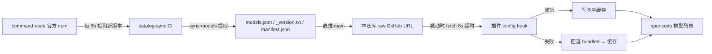

# opencode-commandcode

[](https://github.com/herouu/opencode-commandcode/actions)
[](LICENSE)

[Command Code](https://commandcode.ai) API provider for [opencode](https://opencode.ai) —— 通过一个 API key 使用 Claude、GPT、Gemini、DeepSeek、Qwen、Kimi、GLM、MiniMax、Step 等 50+ 模型。

本仓库是 [BrainerVirus/opencode-commandcode](https://github.com/BrainerVirus/opencode-commandcode) v0.7.54 的**自用 fork**，核心差异：**不发布 npm 包**。模型目录由本仓库 CI 自动同步并直推 `models.json`，插件运行时从 raw URL 拉取——模型列表与插件版本彻底解耦，永远拿最新，无需升级。

## 特性

| 特性 | 说明 |
|---|---|
| 单 key 多模型 | 通过 Command Code Provider API 聚合 50+ 模型 |
| 运行时目录拉取 | 每次启动拉取远端 `models.json`，新模型即时生效 |
| 离线兜底 | 拉取失败自动回退包内静态目录 → 本地缓存 |
| 目录自同步 | CI 每 6 小时检测上游新版本并直推 `main` |
| 数据安全护栏 | 提取失败 / 模型数跌破阈值时开 `catalog-break` issue，绝不推送坏数据 |

## 工作原理



三处关键设计：

1. **目录自更新**：`.github/workflows/catalog-sync.yml` 每 6 小时比对上游 `command-code` npm 版本与 `_version.txt`，有新版本则重新提取模型并**直接推送到 main**（commit 风格：`models.json edited <UTC time> (command-code@X)`）。
2. **运行时解耦**：插件每次启动 fetch 本仓库 raw `models.json`，不再依赖 npm 发版。
3. **质量护栏**：模型数跌破保护线时触发 `catalog-break` issue 并回滚，坏数据不落库。

## 快速开始

```bash
# 1. 克隆本仓库
git clone https://github.com/herouu/opencode-commandcode.git
```

```jsonc
// opencode.json（推荐 file: 引用本地 checkout，或填你的 git 地址）
{
  "$schema": "https://opencode.ai/config.json",
  "plugin": ["file:///absolute/path/to/opencode-commandcode"],
  "provider": {
    "commandcode": {
      "npm": "@ai-sdk/openai-compatible",
      "name": "Command Code",
      "env": ["COMMANDCODE_API_KEY"],
      "options": {
        "baseURL": "https://api.commandcode.ai/provider/v1"
      }
    }
  }
}
```

插件只负责注入 `provider.commandcode.models` 元数据，transport 仍由 `@ai-sdk/openai-compatible` 提供。

## 配置

### API key（三选一）

```bash
export COMMANDCODE_API_KEY="你的 key"     # 方式一：环境变量
```

```bash
opencode auth login --provider commandcode   # 方式二：交互式（/connect 搜 Command Code）
```

方式三：`~/.commandcode/auth.json`（若已用官方 CLI 登录则自动复用）。

### 目录源（可选覆盖）

默认拉取本仓库 `main` 分支的 `models.json`，一般无需配置。需要自定义时可覆盖：

```bash
export COMMANDCODE_CATALOG_URL="https://raw.githubusercontent.com/herouu/opencode-commandcode/main/models.json"
```

或写入 `~/.config/opencode/opencode-commandcode.json`：

```json
{ "catalogUrl": "https://raw.githubusercontent.com/herouu/opencode-commandcode/main/models.json" }
```

| 取值 | 行为 |
|---|---|
| URL | 每次启动拉取该地址（8s 超时），成功后写本地缓存 |
| `disabled` | 关闭远程拉取，仅用包内静态 `models.json` |

### 选择模型

opencode 内运行 `/models` 选择（如 `commandcode/deepseek-v4-flash`）。

## 开发与维护

```bash
bun install
bun run check          # CI 门槛：oxlint + oxfmt --check + bun test + tsc

bun run sync -- --remote   # 本地手动刷新 models.json / manifest.json / _version.txt
```

> ⚠️ `models.json`、`manifest.json`、`_version.txt` 由 CI / 同步脚本自动生成，**不要手改**。

CI 一览：

- **`ci.yml`** — 4 个 check（test / typecheck / lint / format），push 与 PR 触发。
- **`catalog-sync.yml`** — 每 6 小时 + 手动 dispatch，直推 main（不经 PR、不发版）。

## 常见问题

**模型列表不更新？**
先确认能访问 `https://raw.githubusercontent.com/herouu/opencode-commandcode/main/models.json`；再查本机状态 `~/.local/state/opencode/commandcode-provider/startup.json` 里的 `catalogSource` 字段（应为 `remote`）。

**离线环境能用吗？**
能。首次成功后模型已写入本地缓存；离线启动时走 `bundled → cache` 回退链，模型不缺失。

**catalog-break issue 是什么？**
CI 提取失败或模型数异常时自动创建的告警 issue，表示最近一次同步被护栏拦截，正在使用上一份完好目录。

**为什么不再发布 npm？**
自用场景下 npm 发版是纯负担——模型目录经 raw URL 直推，升级插件包没有任何收益。

## 致谢

源自 [FanFan4204/opencode-commandcode-provider](https://github.com/FanFan4204/opencode-commandcode-provider) → [brent-weatherall/opencode-commandcode-provider](https://github.com/brent-weatherall/opencode-commandcode-provider)（[Brent Weatherall](https://github.com/brent-weatherall) 原始实现）。

## 许可证

MIT — 见 [LICENSE](LICENSE)。原始版权归 [Brent Weatherall](https://github.com/brent-weatherall)。
